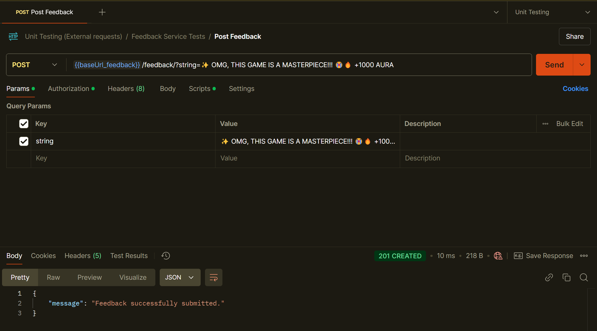
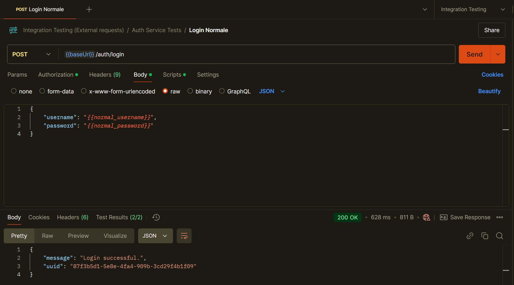

# UNIPI-GatchaAndGames
The **UNIPI-GatchaAndGames** project is a Gacha system developed for the Secure Software Engineering course at the University of Pisa. The system follows a microservices architecture, where each service handles a specific application feature.


*JoJo's Bizarre Adventure by Hirohiko Araki*

## Table of Contents
- [Prerequisites](#prerequisites)
- [Installation and Execution](#installation-and-execution)
- [Shutdown and Cleanup](#shutdown-and-cleanup)
- [Checking Container Status](#checking-container-status)
- [Running Tests](#running-tests)
  - [Unit Testing (Isolation)](#unit-testing-isolation)
  - [Integration Testing](#integration-testing)
  - [Performance Testing](#performance-testing)

## Prerequisites
- Docker and Docker Compose
- [Justfile](https://github.com/casey/just) (optional but recommended)
- Postman
- Locust

## Installation and Execution


*Execution of `just start` command*

Navigate to the `UNIPI-GatchaAndGames` folder and choose one of the following options:

### 1. Without Justfile
[Link to Justfile package](https://github.com/casey/just)

Run the following command:
```bash
find databases \( -name "proxysql_stats.db" -o -name "proxysql.db" \) -type f -delete
docker compose up --build -d
```

### 2. With Justfile (recommended)
```bash
just start
```

> ⚠️ **Warning**: Despite the careful implementation of container startup dependencies, in a few test cases, some database instances failed to start correctly. If this occurs, execute the steps described in the [Shutdown and Cleanup](#shutdown-and-cleanup) section and restart the containers.

---

## Shutdown and Cleanup
Navigate to the `UNIPI-GatchaAndGames` folder and choose one of the following options:

### 1. Without Justfile
Run the following command:
```bash
docker compose down -v
find databases \( -name "proxysql_stats.db" -o -name "proxysql.db" \) -type f -delete
```

### 2. With Justfile (recommended)
```bash
just down
```

---

## Checking Container Status
Navigate to the `UNIPI-GatchaAndGames` folder and choose one of the following options:

### 1. Without Justfile
Run the following command:
```bash
docker ps
```

### 2. With Justfile (recommended)
```bash
just ps
```

---

## Running Tests
### Unit Testing (Isolation)


*Execution of a unit test*

1. Navigate to the `UNIPI-GatchaAndGames/UNIT_TESTING` folder.
2. Run the following command:
   ```bash
   docker compose up --build
   ```
3. Open **Postman** and select the *Unit Tests* collection with the *Unit Testing* environment.
4. Choose the desired Unit Test to execute.

### Integration Testing


*Execution of a integration test*

1. Follow the [Installation and Execution](#installation-and-execution) steps.
2. Open **Postman** and select the *Integration Tests* collection with the *Integration Testing* environment.
3. Choose the desired Integration Test to execute.

### Performance Testing


*Execution of `locust`*
1. Follow the [Installation and Execution](#installation-and-execution) steps.
2. From the `UNIPI-GatchaAndGames/docs/PERFORMANCE_TESTING` folder, run **locust**.
3. Select the desired Performance Test to execute.

---


😸